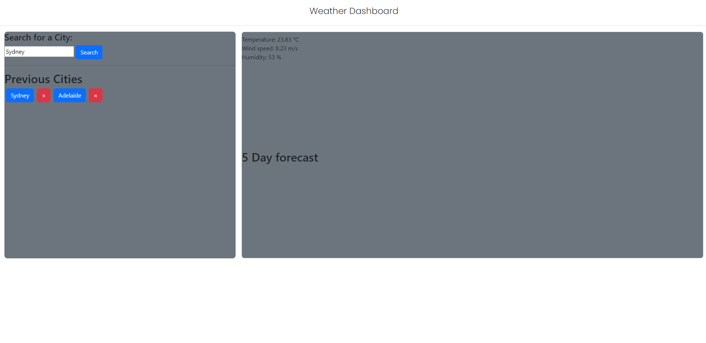

# Digital-Cowboy
A Weather Dashboard with 5 Day forecast of chosen city 

## Weather Dashboard 
A weather forcast generator that can search any city & gather weather data for that city. It also posesses previously seached city buttons to quickly find the weather for those cities  using local storage

## Installation 

-Open in browser to view the web page (Link here - https://thorne7.github.io/Digital-Cowboy/) 
-Open in Visual Studio Code to view the code (if no VS code, open your developer window)

## Credits

Tutorials used during this challenge:

https://getbootstrap.com/docs/4.0/components/buttons/

https://openweathermap.org/api

## Licence 

MIT
